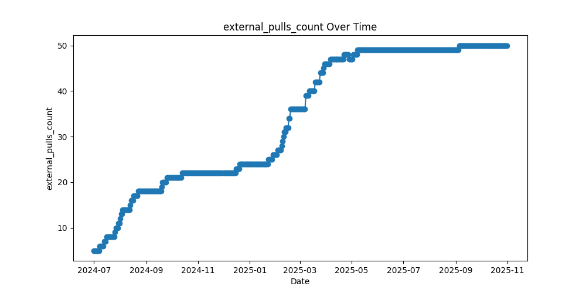

# oss-watchman
Cron Statistics, Persistent, Report for Open Source Software(OSS), All in Git.

<!-- OSS-REPORT:START - Do not remove or modify this section -->
## OSS Report

Below are the statistics charts for the Open Source Software project [KusionStack/karpor](https://github.com/KusionStack/karpor):

### Star History

### External Issues Over Time
This chart shows the number of external issues reported over time.

### External Pull Requests Over Time
This chart illustrates the trend of external pull requests submitted.

### External Contributors Over Time
The chart depicts the count of unique external contributors participating in the project.

### External Participants Over Time
This graph represents the overall number of external participants engaging with the project.

<!-- OSS-REPORT:END -->

## Usage
TODO

## How to work?
TODO
