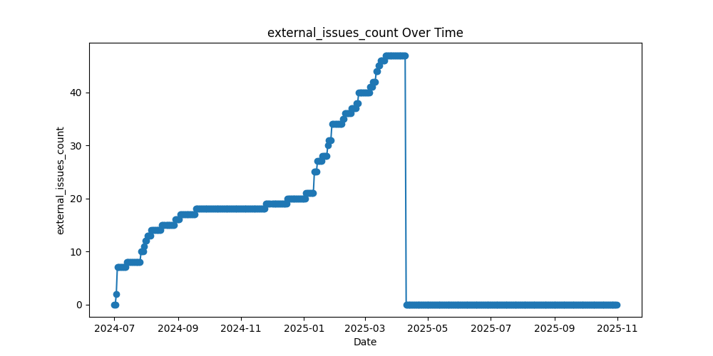
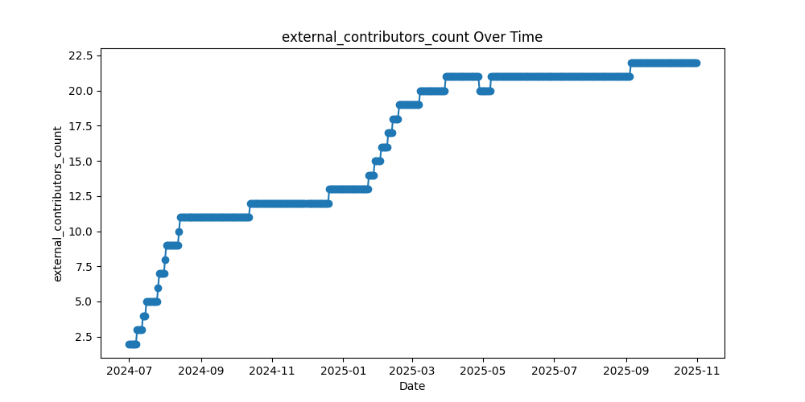
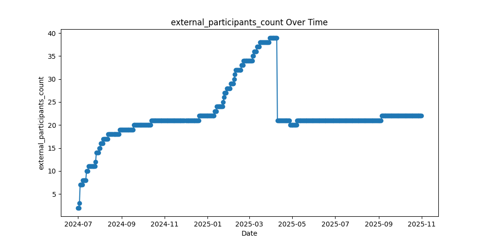

# oss-watchman
**Cron Statistics, Persistent, Update Report** for Open Source Software(OSS), **All in Git**.

<!-- OSS-REPORT:START - Do not remove or modify this section -->
## OSS Report

Below are the statistics charts for the Open Source Software project [KusionStack/karpor](https://github.com/KusionStack/karpor) 👇

### Star History
[](https://star-history.com/#kusionstack/karpor&Date)

### External Issues Over Time
This chart shows the number of external issues reported over time.


### External Pull Requests Over Time
This chart illustrates the trend of external pull requests submitted.


### External Contributors Over Time
The chart depicts the count of unique external contributors participating in the project.


### External Participants Over Time
This graph represents the overall number of external participants engaging with the project.


<!-- OSS-REPORT:END -->

## Usage

### Basic Usage
Run the script to get the current moment's open-source project metrics:
```bash
python stats-github-project.py
```


### Filter Metrics Before a Specific Time
Use the `--before` parameter to specify the filter time in ISO 8601 format:
```bash
python stats-github-project.py --before "2024-08-20T15:56:40+08:00"
```


### Output Only JSON Format
Use the `--only_json` parameter to output only JSON format results:
```bash
python stats-github-project.py --only_json
```


### Fix Existing Metrics Data in the 'data' Directory
Use the `--fix-data` parameter to fix existing metrics data in the 'data' directory:
```bash
python stats-github-project.py --fix-data
```

## How to Work?

### Overview
This script fetches and analyzes GitHub project metrics, including contributors, issues, and pull requests. It distinguishes between internal and external contributors based on a predefined list of internal members.

### Steps
1. **Environment Setup**:
   - Ensure you have Python installed.
   - Install required packages: `pip install requests python-dotenv`.
   - Create a `.env` file with your GitHub token and repository details.

2. **Fetching Data**:
   - The script uses GitHub API to fetch contributors, issues, and pull requests.
   - It handles pagination to ensure all data is retrieved.

3. **Filtering Data**:
   - If the `--before` parameter is provided, the script filters issues and pull requests created before the specified time.
   - If the `--fix-data` parameter is provided, the script iterates through all JSON files in the `data` directory, extracts the timestamp from the filename, and updates the file with the latest metrics.

4. **Output**:
   - The script outputs the results in JSON format by default.
   - If the `--only_json` parameter is provided, it outputs only the JSON format.

### Example Workflow
1. **Initial Run**:
   ```bash
   python stats-github-project.py
   ```

2. **Filter by Time**:
   ```bash
   python stats-github-project.py --before "2024-08-20T15:56:40+08:00"
   ```

3. **Fix Data**:
   ```bash
   python stats-github-project.py --fix-data
   ```

### Notes
- Ensure your GitHub token has the necessary permissions to access the repository.
- The script assumes the `data` directory exists and contains JSON files named in the format `stats-YYYY-MM-DDTHH:MM:SS+0800.json`.
